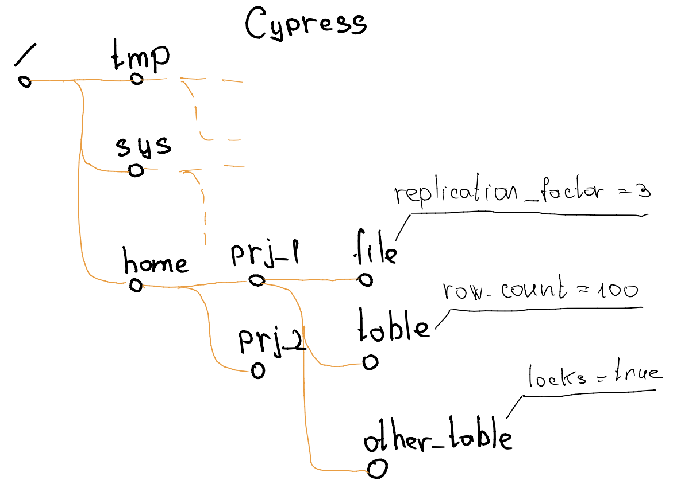
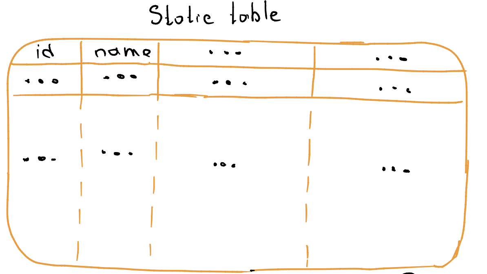
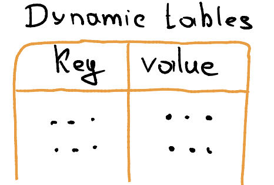
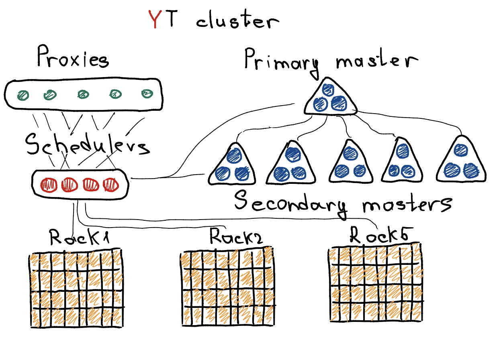
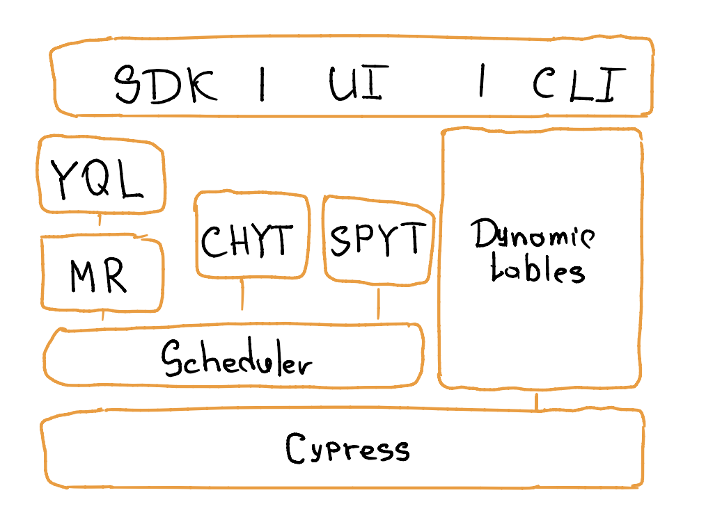

## Что вообще такое YT?

Кратко: это опенсорс платформа распределённого хранения и обработки больших данных.

## А что если объяснить эти слова?

Это отказоустойчивая распределёная система, которая содержит в себе глоабально 2 компонента:
 - Хранение данных:
      * Cypress
      * Статические таблицы
      * Динамические таблицы 
 - Обработка данных:
      * MapReduce операции
      * Click House YT (CHYT)
      * Spark YT (SPYT)

## Что такое распределённое хранение и обработка в Яндексе сейчас?

1. Крупные распредлёные системы, тысячи серверов.
2. Много данных, экзобайт дискового пространтсва.
3. Большое количество вычислительных мощностей, миллионы CPU и тысячи GPU.
4. Хорошая сетевая связность, 10G интрконект.
5. Распределёный планировщик запросов. 

## История развития YT:

1. 2004 год - Google публикует статью о MapReduce и говорит, что у них есть реализация.
2. 2006 год - первый прототип реализации в Yandex - это был YARM (ванильная парадигма MapReduce).
3. 2007 год - Apache Hadoop публикует свою реализацию MapReduce.
4. 2011 год - начало работы над YT - новое поколение MapReduce в Yandex.
5. 2015 год - начало миграции инфраструктуры с YARM на YT.
6. 2016 год - миграция была закончена.
7. 2023 год - YT вышла в опенсорс.

## Что не так было с YAMR?

1. Негибкая система распределения ресурсов. Слоты с одним CPU-ядром и фиксированным количеством памяти.
2. Нет перспектив масштабирования. Десятки тысяч он бы уже не потянул, узким горлышком, кстати был master-server.
3. В целом масса неудачных архитектрных решений, которые мешали развиваться.

## Сущности в YT:

### Cypress: 
1. Единое дерево объектов.
2. Транзакционная файловая система - различные атомарные операции над таблицей.

###  Статические таблицы:
1. Типизация и схематизация.
2. Эффективное хранение - различное кодирование.
3. Таблицы прозрачно интегрированы с MapReduce.
4. Хорошо подходят для batch-вычислений.
5. Таблицы строются из блобиков - иммутабельных блоков, которые хранятся на нодах.

### Динамические таблицы:
1. Сценарии использования: интерактивные сервисы, random-access для MapReduce операций.
2. Постороение индексов в MapReduce модели для использования в рантайме.
3. Записи и удаление по ключу.
4. Низкая латентность.

## Дизайн YT кластера:

### Мастер-сервер:
1. Содержат метаинформацию о системе.
2. Сгруппированы в селлы: группы по 3-5 машин.
3. Метаданные доступны на горячей основе.
4. Существует первичный селл в единственном экземпляре: метаданные кипариса.
5. Вторичные селлы: шардированные метаданные о чанках и селлах.

### Шедулеры:
1. Планирую и запускают операции на данных.
2. Наиболее нагруженные сервера, терабайт оперативы это норм.
3. Реплицированы, переодически делают снепшоты состояния.
4. Всё лежит в оперативной памяти.
5. Поддерживают гарантию изоляции ресурсов и вычислений.

### Ноды: 
1. Хранят чанки с данными.
2. Исполняют запросы мастер сервером на репликацию пользовательских данных.
3. Предоставляют слоты для запуска работы на пользовательские вычисления.
4. Обслуживают диначеские таблицы.

### Прокси:
1. Унифицированные точки входа для всех клиентов.
2. HTTP API.
3. Балансирую нагрузку на ноды.

## Репликация:
1. Мастер сервера - 3x, 5x
2. Шедулеры - 2x
3. Чанки данных - 3x
4. Реплецированные так же точки обслуживания - несколько прокси.

## Модель отказов:
1. Выход из строя дисков.
2. Выход из строя памяти или блоков питания.
3. Выход из строя сетевые стоек.
4. Ряд дата центра.
5. Большии аварии в дата центре.

## Примеры работы с YT:

1. Для работы с YT есть SDK для C++, Go, Java и Pyhton. 
2. Есть консольный клиент CLI.
3. Есть графическая UI оболочка.

## Что можно дешать в помощью YT?
1. Batch MapReduce и SPYT обработка данных
2. Быстрые запросы через CHYT без копирования данных в отдельную аналитическую систему.
3. Транзакционная работа с KV-хранилищем в реальном времени.
4. Управление кластерами GPU для обучения моделей с миллиардами параметров.
5. Транзакционное хранение метаинформации и надёжный сервис распределённых блокировок.
6. Построение хранилищ данных. 

База данных реализована в основном на С++, Scala и Python. По логике это никуда не вклеивалось, поэтому так =)