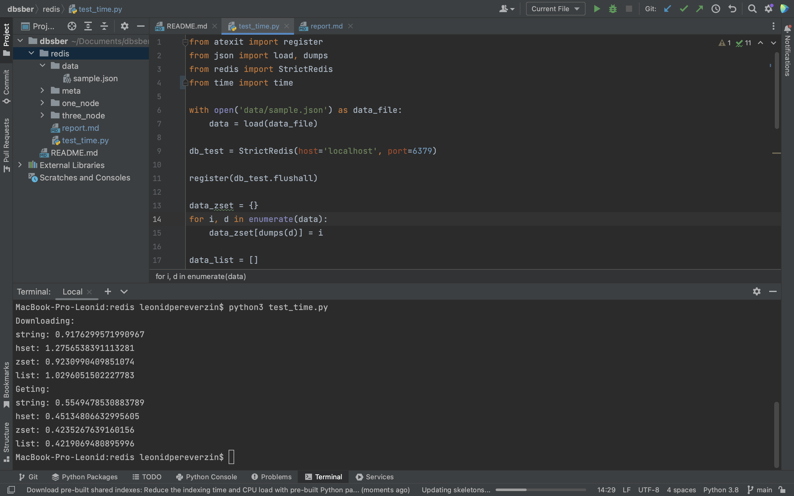
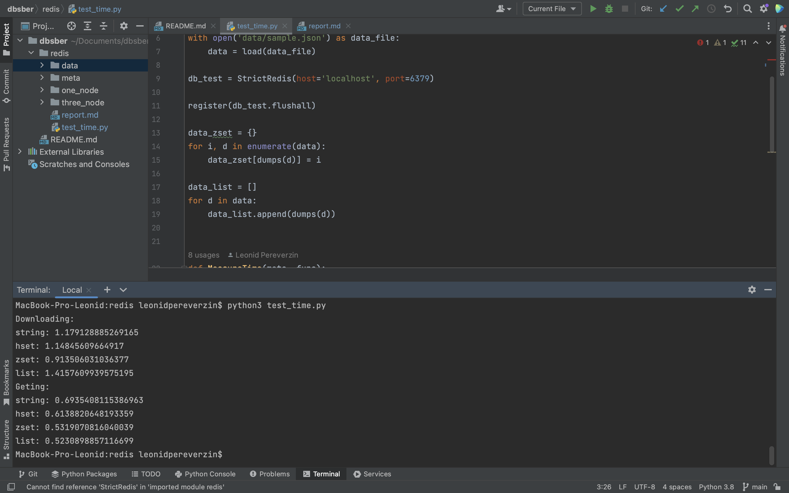

Я провёл мальнькое исследование как работает resis по времени на сохранение и чтение данных для разных структур - string, hset, zset, list.

Docker-compose крипты для запуска redis на одной ноде лежат в директории one_node, а для ззапуска redis на трёх нодах (master и двух slave) лежат в диреткории three_node.

Исследование проводил на dataset'e sample.json размером примерно 26.1 mb. 

Удобнее всего оказалось работать в resis на фреймворке resis на python. Скрипты для запуска семплов приведены в redis_db.py.

Были получены следующие результаты для одной ноды:

Были получены следующие результаты для трёх нод:

Мы видим, что результаты просели, но не критично (ну в смысле не в три раза), это объсняется тем, 
что система у нас стала распределёной, то есть появились затраты на коммуникацию и репликацию. 
Объективности ради не стоит считать это тест объективным,
так как исследование было в рамках одной машины, а значит истинную задержку на сетевое взаимодействие мы не измерили. 